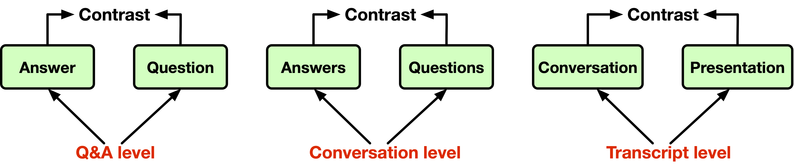

# Contrastive Multi-task Learning for Risk Prediction

This repo provides a reference implementation of **CML-Risk** as described in the paper "Contrastive Multi-task Learning for Risk Prediction":



Submitted to JOC 2023 for review
--------------------

While the earnings transcript dataset cannot be publicly released due to the data provider's policy, we make our contrastive multi-tasking learning implementation publicly available.

Given that the length and label challenges are prevalent in financial markets, we hope that our design and findings can benefit researchers and practitioners and shed light on other financial prediction tasks.

## How to run the code

### Dependencies

Run the following to install a subset of necessary python packages for our code
```sh
pip install -r requirements.txt
```

### Usage

Train and evaluate our models through `main.py`. Here are some vital options:
```sh
main.py:
  --config: Training configuration. Readers can change it to adapt to their specific tasks.
    (default: 'contrastive_multi_mlp.yml')
  --trainer: Init and run model. In our design, we bound trainer with their specific model.
    (default: 'ContrastiveMultiMlpTrainer')
  --test: Whether to evaluate the model with the best checkpoint.
```

### Configurations for evaluation
After training, turn on --test to test model with best checkpoint. We select the best checkpoint according to the MSE results on the validation dataset.

### Folder structure:
* `assets`: contains `best_checkpoint.pth`. Necessary for computing MSE, MAE, Spearsman's rho and Kendal's tau.
* `data`: contains `data_2015.pkl`, `data_2016.pkl`, `data_2017.pkl`, `data_2018.pkl`.
* `model`: contains `contrastive_multi_mlp.py`. Our model's file. We use MLPs to construct the network.
* `utils`: we implement attention, contrastive loss, and other functions here. The InfoNCE PyTorch implementation is referred from [Representation Learning with Contrastive Predictive Coding](https://github.com/RElbers/info-nce-pytorch).

### Data structure
We use Bert-typed pre-trained models from [Sentence Bert](https://www.sbert.net/) to generate sentence embeddings. This model is composed of the pre-trained [Bert-based-un-cased](https://huggingface.co/bert-base-uncased) and a pooling layer. Note that other pre-trained language models such as [RoBERTa](https://huggingface.co/roberta-base) and [FinBert](https://huggingface.co/yiyanghkust/finbert-pretrain) can also be used as the text encoder, but we find the results are similar.


### Ablation study with LDA topic model
We select the topic amounts of the LDA model by coherence score:
```python
import os
import gensim
from gensim.models import CoherenceModel
def compute_coherence_values(dictionary, corpus, texts, limit, start=2, step=3):
    """
    Compute c_v coherence for various number of topics
    Parameters:
    ----------
    dictionary : Gensim dictionary
    corpus : Gensim corpus
    texts : List of input texts
    limit : Max num of topics
    Returns:
    -------
    model_list : List of LDA topic models
    coherence_values : Coherence values corresponding to the LDA model with respective number of topics
    """
    coherence_values = []
    model_list = []
    mallet_path = 'packages/mallet-2.0.8/bin/mallet'
    for num_topics in range(start, limit, step):
        model = gensim.models.wrappers.LdaMallet(mallet_path,
                                                 corpus=corpus,
                                                 num_topics=num_topics,
                                                 id2word=dictionary,
                                                 random_seed=1234,
                                                 workers=os.cpu_count())
        # model_list.append(model)
        coherencemodel = CoherenceModel(model=model, texts=texts, dictionary=dictionary, coherence='c_v')
        coherence_values.append(coherencemodel.get_coherence())

    return model_list, coherence_values
```
Some NLP preprocessing techniques are needed, including converting text to lowercase, removing emojis, expanding contractions, removing punctuation, removing numbers, removing stopwords, lemmatization, etc.
